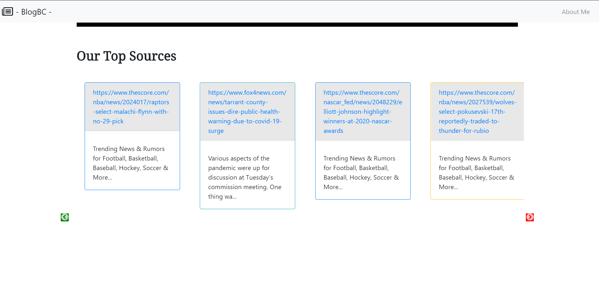
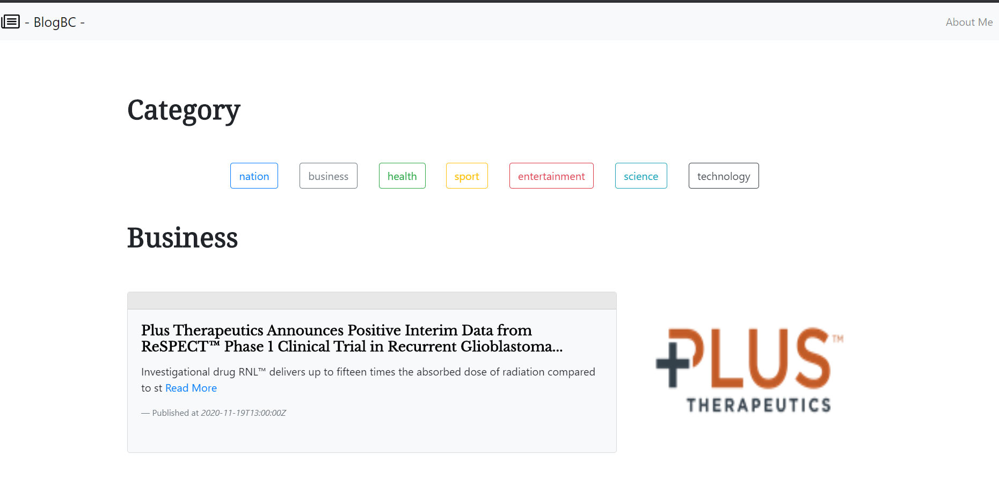

# How to run this project ?

1. clone this repository using "git clone https://github.com/akbariyansyah/blocbc.git" or you can download the zip and then extract it manually.
2. navigate to inside the project and then open terminal / cmd 
3. type "npm install" to install all the depedencies 
4. after that you can type "npm start" to run this project locally

**uploaded version** : blogbc-vercel.app

## Some screenshot

### headline

### source

### regular

